<div align="center">

# KnowledgeAssistant

### AI-powered knowledge assistant built with .NET 10, Blazor, SQL Server and RAG

<p>
  
  
  
  
  
  
</p>

<p>
  A practical full-stack .NET application exploring AI integration, document retrieval,
  authentication, asynchronous processing and modern application architecture.
</p>

</div>

---

## Contents

|        | Section                                 |
| :----: | --------------------------------------- |
| **01** | [Overview](#01--overview)               |
| **02** | [Technology Used](#02--technology-used) |
| **03** | [File Structure](#03--file-structure)   |
| **04** | [Screenshots](#04--screenshots)         |
| **05** | [Features](#05--features)               |
| **06** | [Trade Offs](#06--trade-offs)           |
| **07** | [To Do](#07--to-do)                     |

---

## 01 · Overview

KnowledgeAssistant is a full-stack application built to explore how modern .NET applications can integrate AI with a private knowledge base.

Users can upload documents, process them into searchable chunks and ask questions through an AI chat interface. Relevant document content is retrieved and provided to the AI model as context before generating a response.

The project also includes authentication, role-based authorisation, document management, chat history, background processing and automated testing.

The main goal is to demonstrate practical **.NET + AI development** rather than build a large production platform.

### What it demonstrates

| Area           | Implementation                   |
| -------------- | -------------------------------- |
| Application    | ASP.NET Core / Blazor            |
| AI             | OpenAI + Microsoft.Extensions.AI |
| RAG            | Embeddings + similarity search   |
| Database       | SQL Server + EF Core             |
| Messaging      | RabbitMQ                         |
| Authentication | JWT + role-based authorisation   |
| UI             | Blazor + MudBlazor               |
| Testing        | xUnit + bUnit (UI)               |

---

## 02 · Technology Used

### Backend

* **C#**
* **.NET 10**
* **ASP.NET Core REST Web API**
* **Entity Framework Core**
* **SQL Server**
* **JWT Authentication**
* **Role-based Authorisation**

### Frontend

* **Blazor Web App**
* **MudBlazor**
* **HTML / CSS**
* **JavaScript**

### AI

* **Microsoft.Extensions.AI**
* **IChatClient**
* **OpenAI**
* **Chat models**
* **Embedding models**
* **Vector embeddings**
* **Retrieval-Augmented Generation**

### Messaging & Background Processing

* **RabbitMQ**
* **ASP.NET Core Background Services**
* **Queued email processing**

### Testing & Development

* **xUnit**
* **bUnit**
* **Git**
* **GitHub**
* **Scalar**
* **Visual Studio**
* **GitHub Copilot**
* **Claude**

---

## 03 · File Structure

The solution is currently split into six projects and follows clean architecture layers.

```text
KnowledgeAssistant
│
├── KnowledgeAssistant.API
│   ├── Controllers
│   ├── Middleware
│   └── Program.cs
│
├── KnowledgeAssistant.Application
│   ├── DTOs
│   ├── Handlers
│   ├── Interfaces
│   │   └── Repositories
│   └── Services
│
├── KnowledgeAssistant.Domain
│   ├── Entities
│   └── Enums
|
├── KnowledgeAssistant.Infrastructure
│   ├── BackgroundServices
│   ├── Data
│   │   ├── Configs
│   │   ├── Context
│   │   └── Migrations
│   └── Repositories
│
├── KnowledgeAssistant.Tests
│   ├── API
│   ├── Application
│   └── UI
│
├── KnowledgeAssistant.UI
│   ├── Components
│   │   ├── Authentication
│   │   ├── Common
│   │   ├── Layout
│   │   ├── User
│   │   ├── App.razor
│   │   └── Routes.razor
│   ├── Helpers
│   ├── Pages
│   │   ├── Account
│   │   ├── Admin
│   │   ├── Features
│   │   ├── Error.razor
│   │   ├── Home.razor
│   │   └── Notfound.razor
│   ├── _Imports.razor
│   ├── appsettings.sjon
│   └── Program.cs
│
├── screenshots
│
└── README.md
```

<details>
<summary><strong>Project responsibilities</strong></summary>

### API

Provides the HTTP interface for the application.

Controllers handle incoming requests and delegate operations to the appropriate application services and handlers.

Responsible for:

* HTTP endpoints and request handling
* Authentication and authorisation configuration
* Middleware
* API-specific configuration

### Application

Contains the application's business use cases and application logic.

Responsible for:

* DTOs
* Application interfaces
* Repository interfaces
* Services
* Handlers
* Application-specific business workflows
* Orchestrating operations between the API, domain and infrastructure layers

The Application layer contains abstractions for external concerns such as repositories, allowing the application logic to remain independent of the underlying implementation.

### Domain

Contains the core business model and domain rules of the application.

Responsible for:

* Domain entities
* Enums
* Core business concepts
* Domain-level rules and behaviour

The Domain layer has no dependency on the API, UI, database or infrastructure implementations.

### Infrastructure

Contains implementations for external and persistence-related concerns.

Responsible for:

* Entity Framework Core
* Database context
* EF Core configurations
* Database migrations
* Repository implementations
* Background services
* Integration with external infrastructure and services

Infrastructure implements the interfaces defined by the Application layer and handles communication with external systems such as the database and messaging infrastructure.

### UI

The user-facing Blazor application.

Responsible for:

* Authentication
* AI chat
* Chat sessions
* Document management
* User management
* Administration
* Navigation
* User interface components and pages

### Tests

Contains automated tests covering important application behaviour across controllers, services and UI components.

</details>

---

## 04 · Screenshots

### Login

<div align="center">

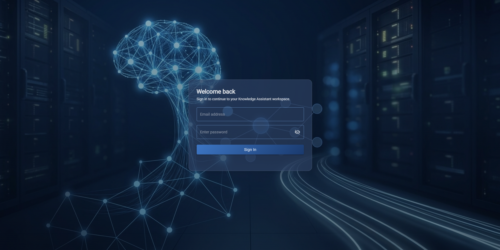

</div>

### Dashboard

<div align="center">

N/A

</div>

### AI Chat

<div align="center">

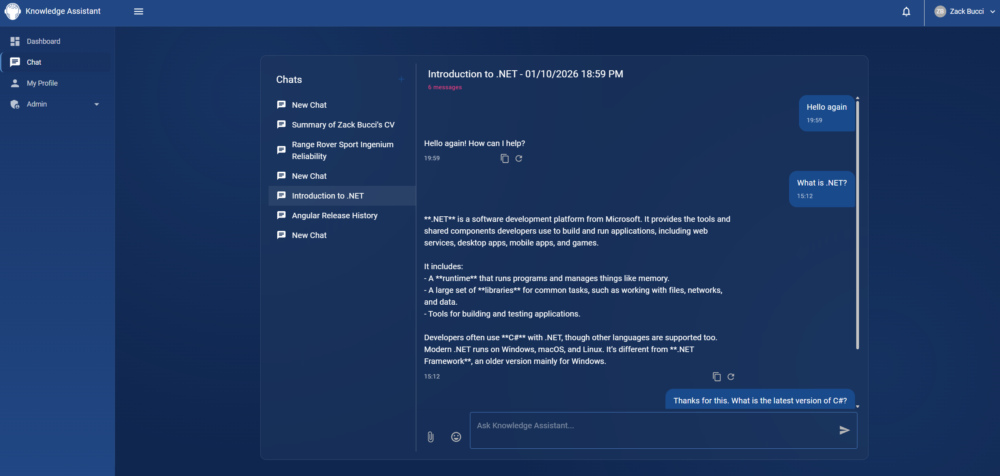
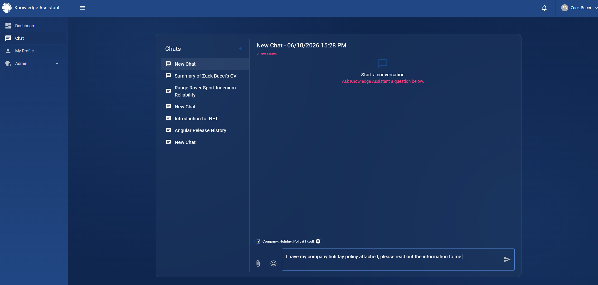
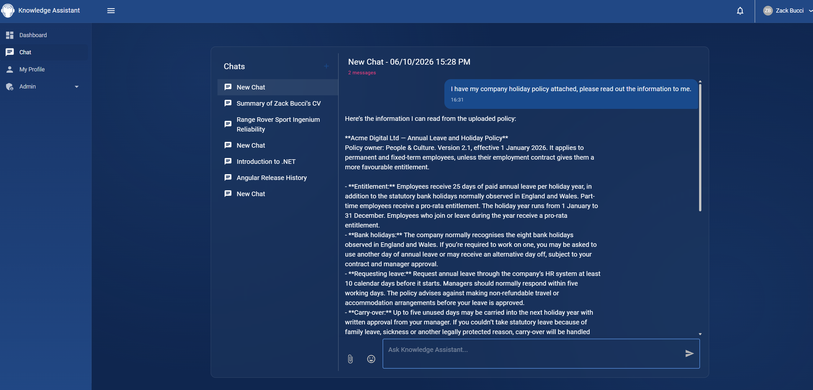
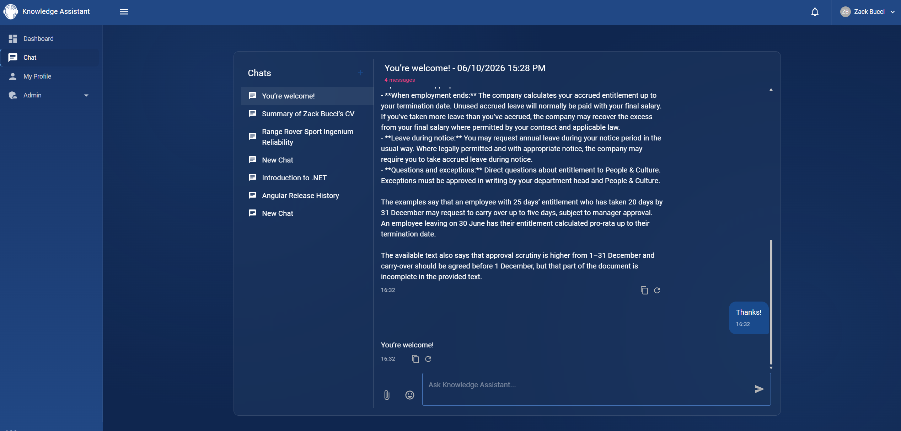

</div>

### Document Management

<div align="center">

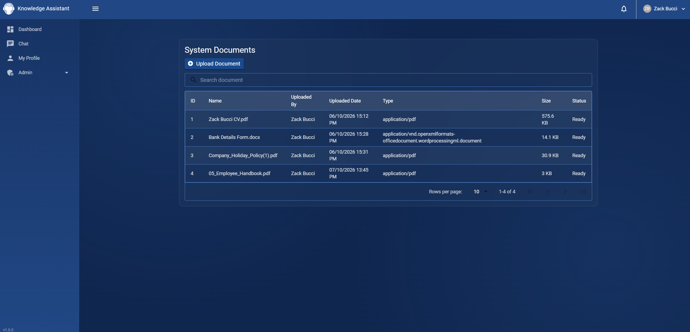
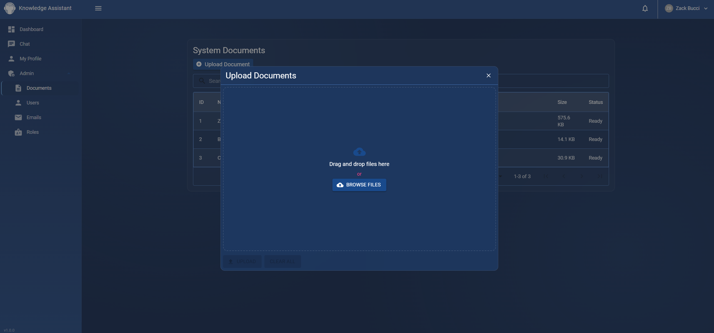

</div>

### User Management

<div align="center">

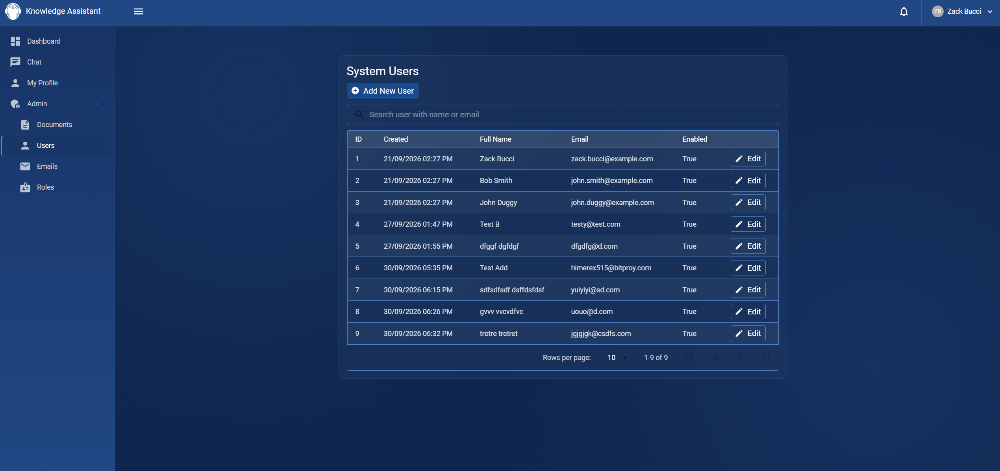
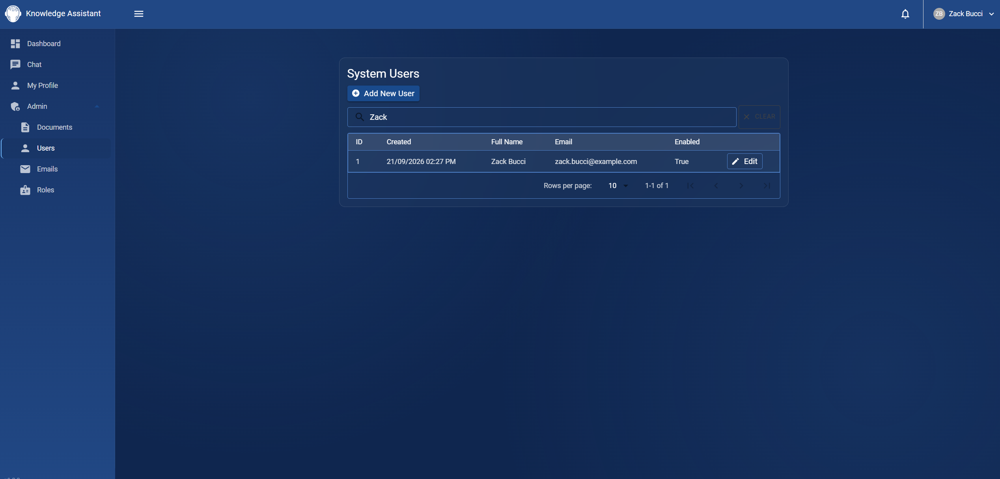
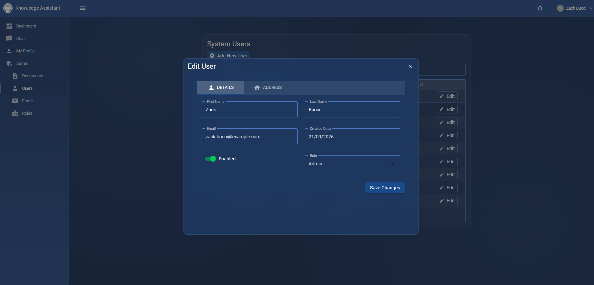

</div>

### Role Management

<div align="center">


</div>

### Email Management

<div align="center">

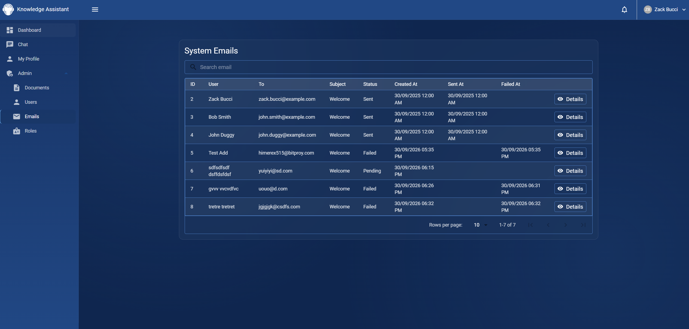

</div>

---

## 05 · Features

### AI Chat

The application uses `IChatClient` from `Microsoft.Extensions.AI` to provide the AI chat functionality.

Chat sessions and messages are persisted, allowing users to maintain multiple conversations.

```text
User
  ↓
Blazor UI
  ↓
API
  ↓
ChatService
  ↓
RAG Retrieval
  ↓
AI Context
  ↓
IChatClient
  ↓
OpenAI
  ↓
Response
  ↓
Save Message
  ↓
UI
```

### Retrieval-Augmented Generation

Documents are split into smaller chunks and embeddings are generated for those chunks.

When a user asks a question, the question is converted into an embedding and compared against the stored document embeddings.

Relevant chunks are then supplied to the AI model as context.

```text
Document
    ↓
Chunking
    ↓
Embedding Generation
    ↓
SQL Server
    ↓
User Question
    ↓
Question Embedding
    ↓
Similarity Search
    ↓
Relevant Chunks
    ↓
AI Context
    ↓
AI Response
```

This allows the application to answer questions using its own documents rather than relying solely on the model's existing knowledge.

### Document Management

Admins users can upload and manage documents through the application.

Documents are processed into smaller chunks which can subsequently be used by the RAG pipeline.

They will be queued asynchronously and be uploaded/added to the database using RabbitMQ

### Chat Sessions

Users can create and return to multiple conversations.

Each session contains its own message history and belongs to the authenticated user.

### Authentication & Authorisation

JWT authentication is used alongside role-based authorisation.

The application currently supports roles such as:

* `Admin`
* `User`

Administrative functionality can therefore be restricted using ASP.NET Core's built-in authorisation system.

### User Management

Administrators can manage users and their assigned roles.

The authenticated user's identity is taken from their claims rather than relying on a user ID supplied by the client.

### RabbitMQ

RabbitMQ is used to move background operations away from the main HTTP request.

For example, emails can be added to a queue and processed by a background consumer rather than being sent during the original API request.

The same pattern will be used for future asynchronous operations such as user notifications and document processing.

### Email Queue

```text
API Request
     ↓
Create Email
     ↓
RabbitMQ
     ↓
Background Consumer
     ↓
Email Provider
     ↓
Email Sent
```

### Caching

`IMemoryCache` is used for data that does not need to be retrieved from the database on every request.

### Rate Limiting

The API includes rate limiting to prevent excessive requests.

### Output Caching

Selected API responses can use ASP.NET Core output caching where appropriate.

### Automated Testing

An xUnit and bUnit test project covers important application behaviour across controllers, services and user interface components.

The focus is on meaningful tests rather than attempting to achieve 100% code coverage and strict TDD.

---

## 06 · Trade Offs

### SQL Server for Application Data and Embeddings

Document data and embeddings are currently stored alongside the application's other data in SQL Server.

This avoids introducing a separate vector database while the project remains relatively small.

**Benefits**

* One database to maintain
* Simple local development
* Lower infrastructure requirements
* Document metadata and embeddings remain together

**Trade-off**

A dedicated vector solution may provide better indexing and retrieval performance at a much larger scale.

---

### In-Memory Caching

`IMemoryCache` is used instead of introducing Redis.

This keeps the application simple and avoids another infrastructure dependency.

**Trade-off**

In-memory caching is tied to an individual application instance, so a distributed cache would be more appropriate for a horizontally scaled deployment.

---

### RabbitMQ

RabbitMQ adds infrastructure and operational complexity compared with performing operations synchronously.

The benefit is that longer-running work can be moved out of the HTTP request and processed independently.

For this project, the additional complexity is useful because it demonstrates a real-world asynchronous processing pattern.

---

### OpenAI Dependency

The application currently uses OpenAI for chat and embedding generation.

The use of `Microsoft.Extensions.AI` and `IChatClient` helps keep the application less tightly coupled to a specific AI implementation.

This makes changing AI providers easier in the future.

---

### Similarity Search

The current RAG implementation performs similarity calculations against stored embeddings.

This keeps the implementation straightforward and makes the underlying RAG process easy to understand.

For a significantly larger document collection, a dedicated vector index or SQL Server's vector capabilities would provide a more scalable approach.

---

## 07 · To Do

The project is intentionally being developed incrementally, with the following features planned to extend the application's AI, messaging and background-processing capabilities.

### Notifications

Introduce an application notification system using RabbitMQ.

Notifications will be queued asynchronously and persisted by a background consumer, allowing users to receive notifications for events such as document processing, system activity and other application events.

Planned functionality:

* User notification inbox
* Unread notification count
* Mark notifications as read
* Queue notifications through RabbitMQ
* Background notification consumer
* Support for multiple recipients
* Notification history

```text
Application Event
       ↓
RabbitMQ
       ↓
Notification Consumer
       ↓
Save Notification
       ↓
User Notification Centre
```

### Asynchronous Document Processing

Move document processing out of the upload/chat request and into a background processing pipeline.

Documents will be uploaded independently through the document management area and processed asynchronously before becoming available to the RAG system.

```text
Document Upload
       ↓
Save Document
       ↓
RabbitMQ
       ↓
Document Processing Worker
       ↓
Extract Text
       ↓
Create Chunks
       ↓
Generate Embeddings
       ↓
Store Chunks + Embeddings
       ↓
Document Ready
       ↓
Notification
```

This will allow users to upload documents without waiting for the entire processing pipeline to complete before continuing to use the application.

### RAG Source Citations & Improved Retrieval

Improve the RAG experience by showing users which documents were used to generate an answer.

Planned functionality:

* Display source documents alongside AI responses
* Show relevant document chunks
* Include page/source information where available
* Improve retrieval using additional search techniques
* Provide greater transparency into how an answer was generated

Example:

```text
AI Response
────────────────────────────────────

Employees are entitled to 25 days of
annual leave per year, excluding bank
holidays.

Sources
────────────────────────────────────
📄 Holiday Policy.pdf
   Page 4

📄 Employee Handbook.pdf
   Page 12
```

### RabbitMQ Retry & Dead-Letter Handling

Introduce retry and dead-letter handling for failed background operations.

This will allow failed messages to be retried automatically and permanently failed messages to be isolated rather than silently lost.

```text
RabbitMQ
    ↓
Consumer
    ↓
  Success ─────────→ Complete
    │
   Error
    ↓
 Retry Queue
    ↓
 Consumer
    │
   Error
    ↓
Dead-Letter Queue
```

This will initially support operations such as document processing, email and notifications.

---

### Future Considerations

Additional functionality may be introduced as the application develops, including:

* AI response streaming
* Conversation memory
* Background job monitoring
* Audit logging
* Docker / containerisation
* CI/CD pipeline
* AI and RAG evaluation metrics

The roadmap is intentionally limited to features that provide meaningful engineering or AI value rather than adding functionality purely for the sake of increasing the application's size.

---

<div align="center">

### KnowledgeAssistant

Built with .NET 10 · Blazor · SQL Server · OpenAI

[Back to top](#knowledgeassistant)

</div>
